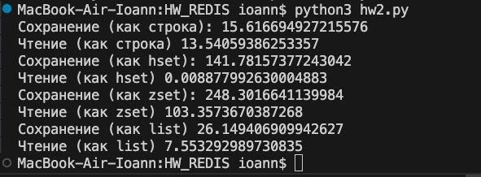
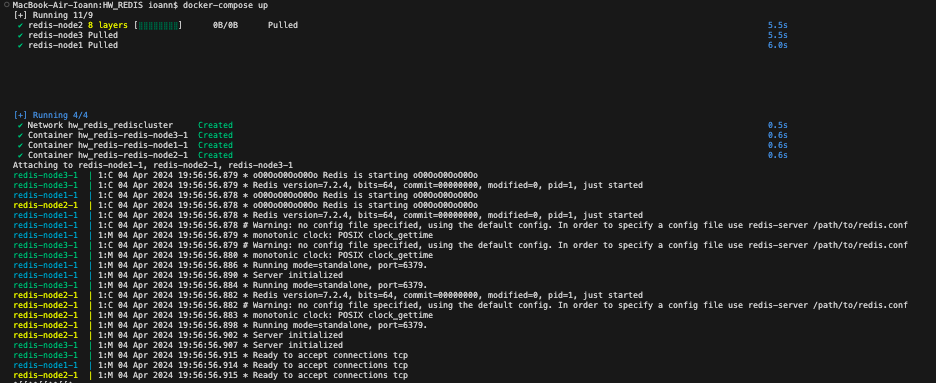

1) в файле hw2.py находится порядок исполнения операций с redis через python  
2)  
3) Тут мы можем увидеть статистику длительности работы с большим json файлом через различные структуры
4) в docker-compose файле находится инструкция по запуску redis на различных нодах с возможной настройкой таймаутов
5) 